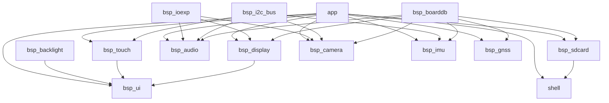

# BSP 架构

## 设计原则

- 先拆数据，再写逻辑
- 消除特殊情况，优先统一模型
- 公共 API 不直接暴露板型分支
- 板差异优先收敛到 board 描述

## 分层

## 当前约定

- `bsp_boarddb` 提供 DoerS3 truth table，AuraS3 当前仅保留占位
- `bsp_boarddb` 按板拆分到 `src/boards/`，公共入口只负责选择当前板
- UI 真值拆成 `display/touch/backlight` 三份描述，不再混在一个 `screen` 结构里
- UI 三个设备都通过 `kind + backend selector` 装配，boarddb 只负责描述 truth
- `bsp_i2c_bus` 负责共享 I2C bus 生命周期
- `bsp_ioexp` 负责 IO 扩展器生命周期，PCA9557 寄存器操作在私有 driver 中
- `bsp_sdcard` 的 SDMMC 接线来自 `bsp_boarddb`
- `bsp_gnss` 负责 UART GNSS 字节流和 NMEA 行读取，不内置解析器
- `bsp_display` 只负责 panel、flush、bitmap 输出
- `bsp_touch` 自己装配 FT5x06，不再依赖 `bsp_display_handle_t`
- `bsp_backlight` 自己装配 PWM，不再依赖 `bsp_display_handle_t`
- `bsp_ui` 是唯一 UI 入口，组合 `display/touch/backlight`
- `shell` 保持公共组件定位，不耦合板级细节

## 后续演进

- 为 `AuraS3` 补齐真实外设真值和差异配置
- 结合 AXP2101 设计 `bsp_power`
