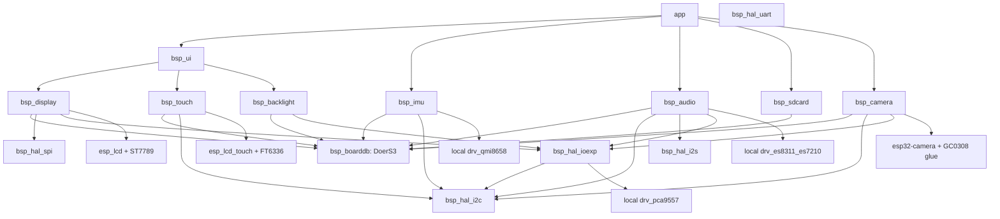
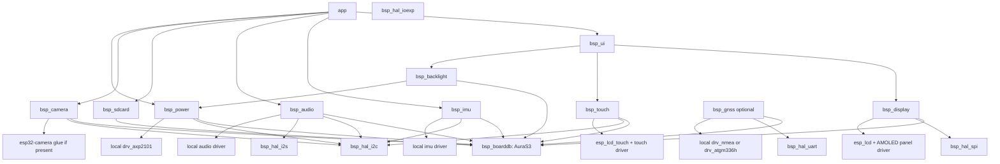

# BSP 设计方案

本文档定义新的 BSP 组织方式，用于同时支持 `DoerS3` 与 `AuraS3`，并作为后续重构的目标结构。

## 1. 设计原则

1. 先统一数据结构，再写组件逻辑。
2. 板差异只允许出现在 board truth table，不允许散落在各设备组件。
3. 设备组件只暴露“设备语义”，不暴露具体板型分支。
4. 优先复用稳定的 Espressif 通用组件；板级 glue 和非通用驱动由仓库自管。
5. 每个设备一个组件，组件之间依赖方向单向、清晰、可测试。

## 2. 总体分层

新的 BSP 采用四层模型：

1. `boarddb`
   - 保存板级真值表
   - 描述共享资源、GPIO、外设挂接关系、能力集合
   - 不写设备流程逻辑
2. `hal`
   - 管理基础资源实例
   - 负责 `I2C/SPI/I2S/UART/IOEXP` 生命周期
   - 不关心上层设备语义
3. `drv`
   - 纯芯片驱动或三方组件适配
   - 只处理单芯片初始化、收发、读写
   - 不关心板型
4. `device component`
   - 对外暴露稳定 BSP API
   - 从 `boarddb` 取 wiring，从 `hal` 申请资源，调用 `drv`
   - 表达“display/touch/imu/audio/...”等设备能力

## 3. 组件拆分清单

### 3.1 基础组件

- `bsp_boarddb`
  - 保存板级真值表
  - 提供当前目标板的静态描述
- `bsp_hal_i2c`
  - 管理 I2C bus 生命周期与共享实例
- `bsp_hal_spi`
  - 管理 SPI bus 生命周期与共享实例
- `bsp_hal_i2s`
  - 管理 I2S 生命周期与共享实例
- `bsp_hal_uart`
  - 管理 UART 生命周期与共享实例
- `bsp_hal_ioexp`
  - 管理 IO 扩展生命周期与 shadow 状态

### 3.2 设备组件

- `bsp_display`
  - 管理 panel、flush、方向、像素输出
- `bsp_touch`
  - 管理触摸设备初始化与点位读取
- `bsp_backlight`
  - 管理亮度输出与亮灭控制
- `bsp_imu`
  - 管理 IMU 初始化、状态读取、可选中断状态查询
- `bsp_audio`
  - 管理 playback / record / duplex 装配与数据流读写
- `bsp_sdcard`
  - 管理 SD 卡初始化、挂载、状态查询
- `bsp_camera`
  - 管理 camera 初始化、启动、取帧、回帧
- `bsp_ui`
  - 组合 `display + touch + backlight`
  - 初始化 LVGL
  - 提供 UI runtime 的 process/pump 接口

### 3.3 非核心、可选组件

- `bsp_gnss`
  - 可选组件
  - 本质上是 UART 上层协议设备
  - 不是核心 BSP 资源组件
- `bsp_power`
  - 可选组件
  - 当前主要面向 `AuraS3` 的电源管理芯片

## 4. 每个组件的职责边界

### 4.1 `bsp_boarddb`

职责：

- 定义板级真值表
- 定义 capability bitmap
- 定义每个设备使用的 bus、地址、GPIO、控制脚来源

不负责：

- 打开总线
- 初始化具体设备
- 执行任何硬件访问

建议接口：

- `const bsp_boarddb_desc_t *bsp_boarddb_get(void);`

### 4.2 `bsp_hal_*`

职责：

- 按资源类型管理底层实例
- 处理共享资源的引用计数
- 统一 bus open/close/get

不负责：

- 板型判断
- 芯片寄存器配置
- 设备语义封装

建议接口风格：

- `open`
- `close`
- `get`
- `is_ready`

### 4.3 `bsp_display`

职责：

- 根据 board truth table 装配 panel
- 输出像素
- 设置方向、镜像、色彩格式等显示属性

不负责：

- 触摸读取
- 背光控制
- LVGL 生命周期

说明：

- `display` 与 `touch` 必须拆开
- `display` 与 `backlight` 也必须拆开

### 4.4 `bsp_touch`

职责：

- 根据 board truth table 装配触摸控制器
- 提供统一点位读取接口

不负责：

- 显示输出
- UI 框架输入绑定

### 4.5 `bsp_backlight`

职责：

- 控制背光输出
- 统一 GPIO / PWM / power chip 控制差异

不负责：

- display flush
- UI 逻辑

说明：

- `DoerS3` 的背光是相对简单的输出控制
- `AuraS3` 后续如果亮度控制依赖电源芯片，也仍然收敛到 `bsp_backlight`

### 4.6 `bsp_imu`

职责：

- 根据 board truth table 装配 IMU
- 提供统一姿态数据读取接口

不负责：

- 数据滤波
- 姿态融合
- 上层事件解释

### 4.7 `bsp_audio`

职责：

- 管理 codec、PA、I2S 数据路径
- 支持 playback / record / duplex
- 暴露统一 stream API

不负责：

- 音乐解码
- 文件系统
- 上层播放器逻辑

说明：

- `audio` 采用本仓库自管，不依赖组件管理器的高层音频封装
- 板型差异体现在 board truth table 和 codec/PA wiring 上

### 4.8 `bsp_sdcard`

职责：

- 初始化 SD 外设
- 提供卡状态和挂载入口

不负责：

- Shell
- 文件协议
- 业务目录结构

### 4.9 `bsp_camera`

职责：

- 装配 sensor 与 camera host
- 提供 start/stop/fb_get/fb_return

不负责：

- 图像算法
- UI 显示

### 4.10 `bsp_ui`

职责：

- 组合 `bsp_display`、`bsp_touch`、`bsp_backlight`
- 初始化 LVGL runtime
- 提供 flush / input / process

不负责：

- 业务页面
- app 生命周期
- 非 UI 外设

说明：

- `bsp_ui` 是正式 BSP 边界的一部分
- 业务 UI 代码只依赖 `bsp_ui`，不直接接管 display/touch/backlight 生命周期

### 4.11 `bsp_gnss`

职责：

- 可选地将 UART 字节流封装为 GNSS 语义数据

不负责：

- UART 资源管理

说明：

- `GNSS` 不是第一层核心设备
- 它是挂在 `UART` 上的协议设备
- 当前第一版只负责 raw bytes / NMEA line 读取，不内置 NMEA parser

## 5. 驱动归属策略

驱动分为两类：

1. 组件管理器提供的外部驱动
2. 仓库内自管驱动

原则：

- 通用、成熟、稳定、Espressif 已维护的组件优先外部依赖
- 板级 glue、需要深度可控、官方生态不完整的驱动优先仓库自管

## 6. 哪些驱动走组件管理器，哪些放本仓库

### 6.1 通过 ESP 组件管理器复用

#### Screen

- `esp_lcd`
- 对应 panel driver
  - `DoerS3`: `ST7789`
  - `AuraS3`: 以后根据实际 AMOLED panel 型号接入相应 driver

#### Touch

- `esp_lcd_touch`
- 对应 touch driver
  - `DoerS3`: `FT6336/FT6X36`
  - `AuraS3`: 根据实际触摸芯片接入

#### Camera

- `esp32-camera`

说明：

- `screen/touch/camera` 只复用通用驱动能力
- 板级接线、reset、CS、电源时序、mirror/swap 仍然由本仓库设备组件负责装配

### 6.2 本仓库自管

#### IMU

- `QMI8658`

#### IO Expander

- `PCA9557`

#### Power

- `AXP2101`
- 以及后续可能接入的其它 PMIC

#### GNSS

- `ATGM336H`
- NMEA 字节流 / 行读取

#### Audio

- `ES8311`
- `ES7210`
- PA / mute / route control
- I2S stream glue

说明：

- `audio` 明确采用自管理
- 不依赖组件管理器中的高层 audio solution
- 这样可以最大限度控制板级 routing、PA 使能、双 codec 组合和延迟策略

## 7. Board Truth Table 组织要求

每块板只保留一份集中描述文件，例如：

- `components/bsp_boarddb/src/boards/doers3.c`
- `components/bsp_boarddb/src/boards/auras3.c`

每份 truth table 至少包含：

- board id / name
- capabilities
- 当前共享资源配置，例如 i2c / ioexp
- 设备自己的 bus 绑定和引脚配置，例如 display 的 SPI wiring、audio 的 I2S wiring、gnss 的 UART wiring
- ioexp 配置
- display wiring
- touch wiring
- backlight wiring
- imu wiring
- audio wiring
- sdcard wiring
- camera wiring
- 可选 gnss / power wiring

要求：

- 不允许在 `bsp_display`、`bsp_touch`、`bsp_audio` 等组件里再写一份板型 backend 文件
- 板型差异只能在 truth table 中声明

## 8. DoerS3 依赖图

DoerS3 特点：

- `display` 使用 `ST7789`
- `touch` 使用 `FT6336`
- `LCD_CS / PA_EN / DVP_PWDN` 由 `PCA9557` 控制
- `IMU` 为 `QMI8658`
- `audio` 为 `ES8311 + ES7210`
- `camera` 为 `GC0308`
- `GNSS` 固定占用 `UART1`

## 9. AuraS3 依赖图

AuraS3 特点：

- `display/touch/power` 很可能与 `DoerS3` 完全不同
- `backlight` 可能不再是简单 GPIO/PWM，可能需要经由 PMIC 控制
- `power` 是一等可选组件
- `gnss` 是否存在不作为核心 BSP 前提
- `camera` 是否存在由 truth table 决定

## 10. 建议的组件依赖方向

统一规则：

- `app -> bsp_ui / bsp_display / bsp_touch / bsp_audio / ...`
- `bsp_* device -> bsp_boarddb`
- `bsp_* device -> bsp_hal_*`
- `bsp_* device -> driver`
- `driver` 不反向依赖 `bsp_* device`
- `bsp_boarddb` 不依赖任何设备组件

禁止出现：

- `bsp_display` 依赖 `bsp_touch`
- `bsp_audio` 依赖 `bsp_camera`
- `bsp_ui` 之外的设备组件直接依赖 LVGL
- 各设备组件内部再维护一套 `boards/*.c` backend

## 11. API 风格建议

所有设备组件统一采用类似接口风格：

- `get_desc`
- `open`
- `close`
- `read/write/get_frame/set_xxx`

示例：

- `bsp_display_open()`
- `bsp_display_draw_bitmap()`
- `bsp_touch_open()`
- `bsp_touch_read_points()`
- `bsp_imu_open()`
- `bsp_imu_read()`
- `bsp_audio_open()`
- `bsp_audio_read()`
- `bsp_audio_write()`
- `bsp_ui_open()`
- `bsp_ui_process()`

说明：

- 不再推荐 `*_present()` 这类接口
- 能力与存在性统一由 `bsp_boarddb` 或 `desc` 表达

## 12. 后续收敛方向

按下面顺序继续收敛：

1. 补齐 `AuraS3` 真实 truth table
2. 设计并接入 `bsp_power`
3. 按需补齐 `bsp_hal_spi`、`bsp_hal_i2s`、`bsp_hal_uart`
4. 统一剩余设备 API 命名为 `get_desc/open/close/read/write/get_frame/set_xxx`
5. 在需要结构化定位数据时，再接入 NMEA parser

## 13. 最终目标

最终希望做到：

- 新增一块板时，只需要新增一份 truth table，加上必要的新芯片驱动
- 设备组件不再复制板型 backend
- `DoerS3` 与 `AuraS3` 共享同一套设备 API
- UI 层只依赖 `bsp_ui`
- 每个组件都能独立构建与验证
